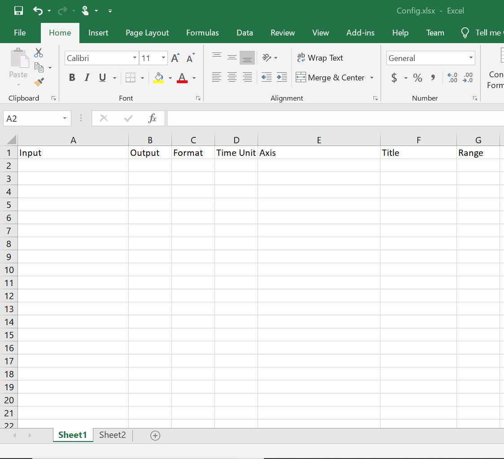
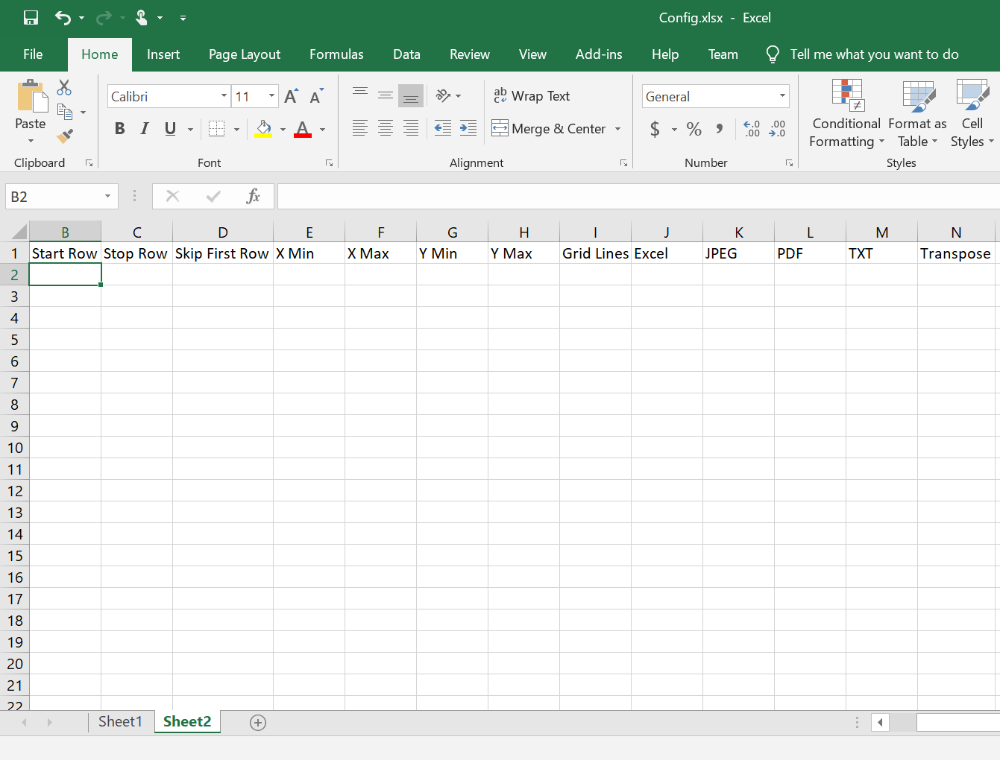

# Data Processing

A data processing Python executable that will take in a CSV file and 

>1) create an Excel version of the CSV file 
>2) import only the desired data into an Excel, JPEG, PDF, and text file 
>3) create a plot of the processed results with Excel and matplotlib 

## Table of Contents 

1. [General Info](#general-info)
2. [Getting Started](#getting-started)
	1. [Prerequisites](#prerequisites)
	2. [Running](#running)
3. [Background](#background)
	1. [Default Options](#default-options)
4. [Warnings](#warnings)
5. [Future Refinements](#future-refinements)
## General Info

The purpose of this project is to develop an automated processing program that will streamline data formatting of routinely conducted experiments. The software will take in a CSV file and output an Excel version of the CSV file as well as a Excel, JPEG, PDF, and/or text file of the processed results. The Excel, JPEG, and PDF files will contain a chart of the processed results. 

All the output files will be stored in a subdirectory titled `output_filename`. 

## Getting Started

### Prerequisites 

The application code is built with Python 3.7. Package Dependencies: `numpy`, `pandas`, `matplotlib`, `openpyxl`, `PyPDF2` **_However, the software that you need to run is a standalone executable._** The application code is for reference. 

In addition to the exectuable `data_processing.exe`, users will need an Excel file with two sheets to serve as the configuration file. **_Make sure the CSV and the configuration file are in the same directory as the executable._**

### Running 
To run the program, download and run `data_processing.exe`. The program will continue to repeat as long as the user enters 'Y' or 'y' when prompted if they want to process another file. 

## Background
'Sheet 1' of the configuration file gives the 'mapped settings' of the program. This sheet will extract only the data that the users want and import it to the output files. The sheet should look like: 

	
**_Except for inputs for the 'Title' column, all inputs are case insensitive._**

Each row in the configuration file corresponds to a single column of data in the CSV file. 
- **Input** (`str` or `'int`): Column letters of the CSV columns we want mapped
    * If transposing rows to columns, enter the column numbers we want mapped
- **Output** (`str`): Column letters of the Excel columns we want the CSV data to be mapped to 
- **Format** (`int`): Sig figs we want the data to be rounded to
- **Time Unit** (`str: 'D', 'M', 'H', 'S'`): How time is represented. 'D' is datetime, 'H' is hours, 'M' is minutes, and 'S' is seconds. Corresponding CSV column will convert the time into elapsed time with format HH:MM:SS   
- **Axis** (`str: 'X', 'Y'`) Indicate whether CSV column will serve as an axis on the graph. 'X' for x-axis, 'Y' for y-axis. Can have multiple y-axis. _A plot will only be generated if the axis are indicated!_ 
- **Title** (`str`): Title of the CSV column in the output files 
- **Range** (`str: Start:End`) : Interval of data in column that is to be processed. Indices will be based off of the data itself, not the Excel row numbers. i.e. The first cell of data is _1_. 
    * `:End` : Start at the beginning of the file and stop at a specific data cell
    * `Start:`: Start at a specific data cell and read until the very end

'Sheet 2' gives the 'general settings' of the program. The sheet should look like: 

**_All inputs are case insensitive._**

There will be 1 input for every column; each input should be inserted right underneath the column titles.  

- **ChartTitle** (`str`): Title of chart
- **Start Row** (`int`): Row to begin processing CSV file. Index will be based on CSV file. Must start at column title row.  
- **Stop Row** (`int`): Row to stop processing CSV file. 
- **Skip First Row** (str: 'Yes', 'No'): Indicate whether you want to skip the first row of data. Prevents elapsed time from being based off of a time value from a previous experiment. 
- **X Min** (`float`): Minimum value on x-axis of chart. Does not work on datetimes or timedeltas. 
- **X Max** (`float`): Maximum value on x-axis of chart. Does not work on datetimes or timedeltas. 
- **Y Min** (`float`): Minimum value on y-axis of chart. Does not work on datetimes or timedeltas. 
- **Y Max** (`float`): Maximum value on y-axis of chart. Does not work on datetimes or timedeltas. 
- **Grid Lines** (`str: 'Yes', 'No'`): Indicate whether grid lines on chart will be turned on or off
- **Excel** (`str: 'Yes', 'No'`): Indicate whether an Excel file of processed results will be generated
- **JPEG** (`str: 'Yes', 'No'`): Indicate whether a JPEG file of processed results will be generated
- **PDF** (`str: 'Yes', 'No'`): Indicate whether a PDF file of processed results will be generated 
- **TXT** (`str: 'Yes', 'No'`): Indicate whether a txt file of processed results will be generated
- **Transpose** (`str: 'Yes', 'No'`): Indicate whether to transpose rows to columns 

### Default Options

**_'--' indicates that there will be no error generation if no value is inputted._**

In 'Sheet 1': 
- **Input**: N/A
- **Output**: N/A
- **Format**: --
- **Time Unit**: --
- **Axis**: --
- **Title**: Title of the column in the CSV file 
- **Range**: All 

In 'Sheet 2': 
- **Graph Title**: Syntax will be `All y-axis column labels vs x-axis column label`
- **Start Row**: 1
- **Stop Row**: --
- **Skip First Row**: No
- **X Min**: --
- **X Max**: --
- **Y Min**: --
- **Y Max**: --
- **Grid Lines**: Yes
- **Excel**: Yes
- **JPEG**: Yes
- **PDF**: Yes
- **TXT**: Yes
- **Transpose**: No

## Warnings: 
- Cannot plot data with different lengths
- Cannot transpose columns to rows
- **Range** column in the Excel configuration file must be formatted so it is read as 'Text,' otherwise it will be converted into time. 
- Milliseconds will be removed when converting into elapsed time. 
- A JPEG file will not be generated if a chart is not processed, even if **JPEG** is set to 'Yes.'
- Formatting for PDF and txt file get...wonky.  

## Future Refinements
- Replace text interface with a GUI using PyQt5. 

